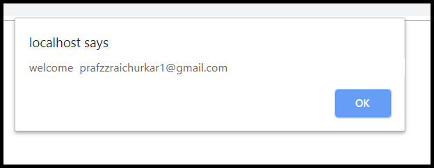
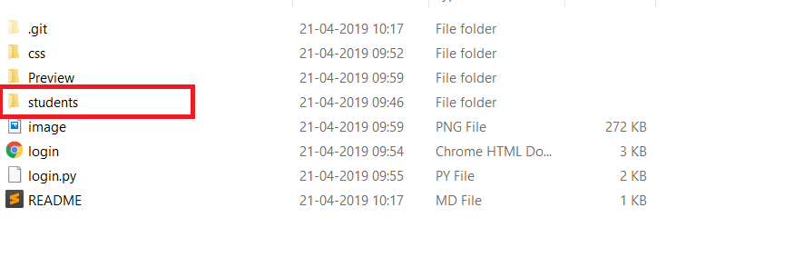

<h1 align=center> Face Recognition Login System </h1>
<hr/>
<h4 align="center"> :camera: A facial recognition based login system using Python,HTML,CSS and Bootstrap 
</h4>
<h2>Preview</h2>


<hr/>
<h2> Tools & Libraries Used </h2>
<hr/>
<ul>
  <b>
<li> Python - face_recognition - https://github.com/ageitgey/face_recognition </li>
<li> XAMPP - https://www.apachefriends.org/download.html </li>
<li> Bootstrap - https://getbootstrap.com/ </li>
<li> CGI </li>
    
    
  </b>
</ul>
<strong> Note </strong>  - These files must be hosted on XAMPP Apache server or other server, else login.py will not work.

<hr/>
<h2> Working </h2>

- Install Python
- Install XAMPP
- Navigate to `htdocs` fodler and clone this project.
- Open `login.py` and make sure to replace the top comment `#! C:\Python39\python.exe` with your python path.
- Navigate to `htdocs/face-recognition-login-system` and execute the following command `pip install -r requirements.txt`
- Navigate to `xampp/apache/config` and modify the `httpd.conf` file by adding  
```conf
Options Indexes FollowSymLinks Includes ExecCGI
AddHandler cgi-script .py .cgi .pl .asp
```   
at the end of the file. Then save & exit
- Then run XAMPP & go to `localhost/face-recognition-login-system/login.html`
- Put all the images of students in the 'students' folder 
  
- Pictures must be in the format (email_address_of_student).jpg 
 
 <br>
<b>Optional -</b> <i>you can create a seperate registration form for students, where they may upload their picture and the picture gets stored as (email_address).jpg in the 'students' folder.</i>

<hr/>

<h2> Making it work for Windows </h2>
<p>
Go to the python's installed location , in my case it was (C:\Python39) and right click on the 
python39 folder and go to security tab and give "Full Control" permission to users
</p>
</br/>
<p>
And then go the scripts folder in python's installed path
(C:\Python39\Scripts)
</p>
and run the below commands in that folder 
<br/>

Command 1 : `C:\python39\python.exe -m pip install --upgrade pip --user`

In the above command replace the exe path with your path

Comand 2 : `pip install cmake --ignore-installed`

Command 3 : `pip install dlib --ignore-installed`

Command 4 : `pip install face_recognition --ignore-installed`

Then try to restart the XAMPP Server it should work.

If it did not work, try installing below tools on windows
- CMAKE
- Visual Studio with CMAKE Build tools installed

Also to for debugging, ensure to check Apache Error Logs


Kindly follow the below Reference issues in case you are stuck 
https://github.com/ageitgey/face_recognition/issues/1016
https://stackoverflow.com/questions/51912999/could-not-install-packages-due-to-an-environmenterror-winerror-5-access-is-de
