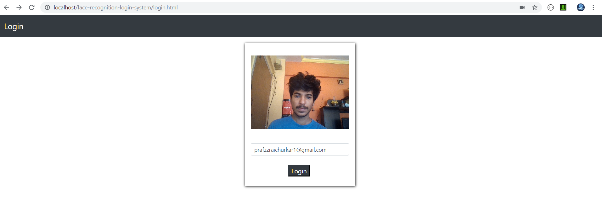

<h1 align=center> Face Recognition Login System </h1>

<h2>Preview</h2>

<h2> Tools & Libraries Used </h2>

<ul>
  <b>
<li> Python - face_recognition - https://github.com/ageitgey/face_recognition </li>
<li> XAMPP - https://www.apachefriends.org/download.html </li>
<li> Bootstrap - https://getbootstrap.com/ </li>
<li> CGI </li>
  </b>
</ul>

<h2> Working </h2>
<ol>
  <b>
  <li> Put all the images of students in the 'students' folder </li>
  
  <li> Pictures must be in the format (email_address_of_student).jpg </li>
   
  </b>
  </ol>
Optional -  *you can create a seperate registration form for students, where they may upload their picture and the picture gets stored as (email_address).jpg in the 'students' folder* 

